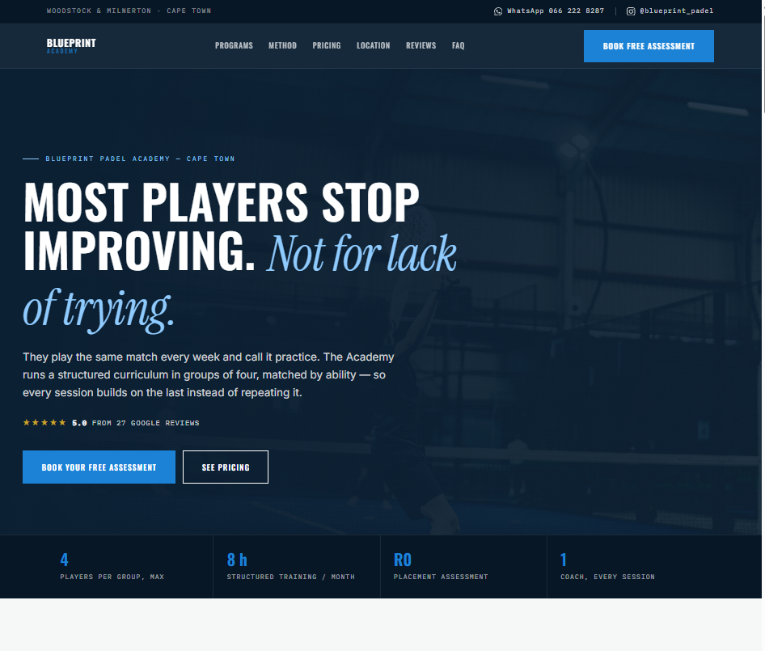
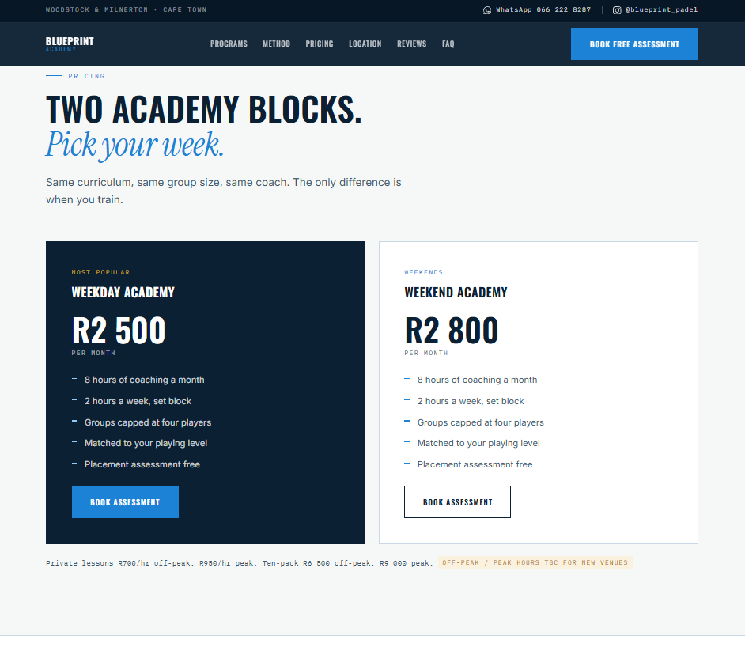

# Blueprint Padel

A full client website build for a padel coaching business in Cape Town — from design and photography curation through to deployment.

**Live site:** [blueprintpadel.co.za](https://blueprintpadel.co.za)

## What it is

Two distinct single-page sites built for an A/B test:

- **Academy site** (`blueprintpadel-academy-v2.html`) — dark, performance-oriented design selling the structured coaching system, with a photo marquee, pricing, and location details for the client's two coaching venues
- **Coach site** (`blueprint-padel-v2.html`) — warmer, editorial design selling the personal coaching relationship

## Why two sites

Rather than guessing which positioning would convert better, both sites were deployed simultaneously to measure real bookings and WhatsApp enquiries, with the plan to redirect the lower-performing domain to the winner.

## Tech stack

- Single self-contained HTML files — no build step, no framework
- Base64-embedded imagery for zero-dependency deployment
- Deployed via Vercel

## What went into it

- Real venue details, pricing tiers, and booking flow (WhatsApp-first, matching how the client's customers actually prefer to book)
- A 19-image professional photo shoot processed and embedded directly into the page
- Structural inspiration drawn from analyzing top-performing local service business landing pages (trust strip, named services, clear pricing, FAQ, single CTA)
- Live Google reviews integration

## Status

Live and in active use by the client. Maintained as venue details and pricing change.

---

Built by [Yusuf Da Costa](https://github.com/myusufdacosta) — open to freelance and contract work.

## Screenshots

### Hero section

### Pricing

